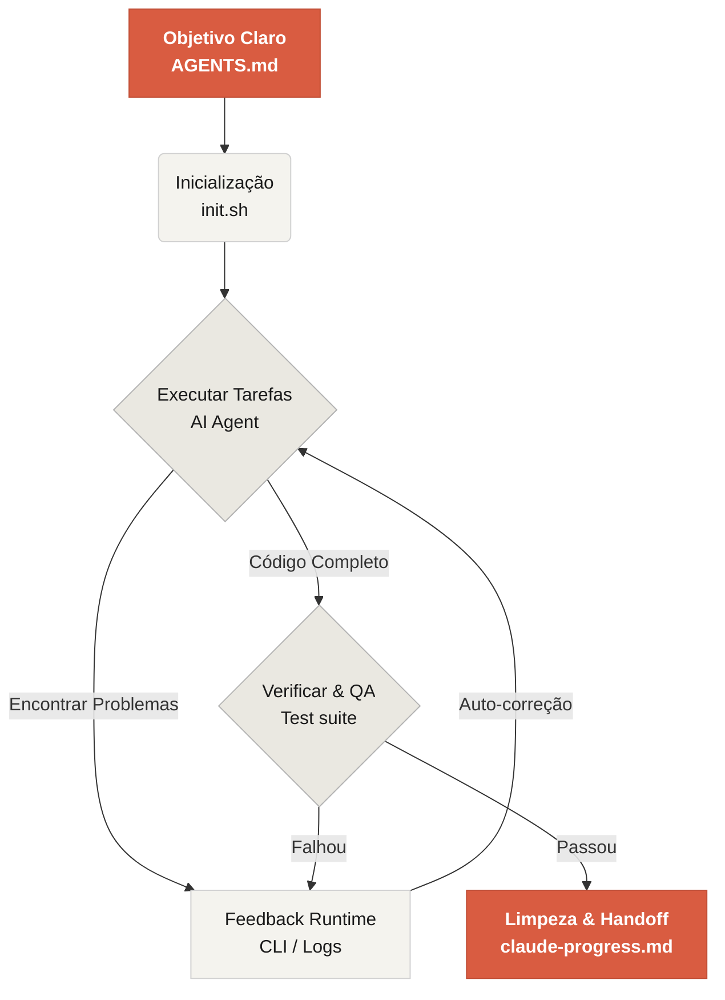

# Bem-vindo ao Learn Harness Engineering

Learn Harness Engineering é um curso dedicado à engenharia de agentes de codificação de IA. Estudamos profundamente e sintetizamos as teorias e práticas mais avançadas de Harness Engineering da indústria. Nossas referências principais incluem:
- [OpenAI: Harness engineering: leveraging Codex in an agent-first world](https://openai.com/index/harness-engineering/)
- [Anthropic: Effective harnesses for long-running agents](https://www.anthropic.com/engineering/effective-harnesses-for-long-running-agents)
- [Anthropic: Harness design for long-running application development](https://www.anthropic.com/engineering/harness-design-long-running-apps)
- [Awesome Harness Engineering](https://github.com/walkinglabs/awesome-harness-engineering)

Através de design sistemático de ambiente, gerenciamento de estado, verificação e sistemas de controle, este curso ensina como tornar ferramentas de codificação agêntica como Codex e Claude Code verdadeiramente confiáveis. Ajuda você a construir features, corrigir bugs e automatizar tarefas de desenvolvimento restringindo seu assistente de codificação de IA com regras e limites explícitos.

## Começar

Escolha seu caminho de aprendizado para começar. O curso é dividido em lectures teóricas, projetos práticos e uma biblioteca de recursos prontos para copiar.

  <a href="./lectures/lecture-01-why-capable-agents-still-fail/" class="card">
    <h3>Lectures</h3>
    
Entenda por que modelos fortes ainda falham e aprenda a teoria por trás de harnesses eficazes.

  </a>
  <a href="./projects/" class="card">
    <h3>Projetos</h3>
    
Prática hands-on construindo um ambiente agêntico confiável do zero.

  </a>
  <a href="./resources/" class="card">
    <h3>Biblioteca de Recursos</h3>
    
Templates prontos para copiar (AGENTS.md, feature_list.json) para usar em seus próprios repositórios.

  </a>

## O Mecanismo Central de um Harness

Um harness não "torna o modelo mais inteligente"; em vez disso, estabelece um **sistema de trabalho** de loop fechado para o modelo. Você pode entender seu workflow central através deste diagrama simples:

## O que você vai aprender

Aqui estão alguns dos conceitos-chave que você dominará:

<ul class="index-list">
  <li><strong>Restringir comportamento do agent</strong> com regras e limites explícitos.</li>
  <li><strong>Manter contexto</strong> através de tarefas de longa duração e múltiplas sessões.</li>
  <li><strong>Impedir agents</strong> de declarar vitória muito cedo.</li>
  <li><strong>Verificar trabalho</strong> usando testes de pipeline completo e auto-reflexão.</li>
  <li><strong>Tornar runtime observável</strong> e debugável.</li>
</ul>

## Próximos passos

Uma vez que você entenda os conceitos centrais, estes guias ajudam você a se aprofundar:

<ul class="index-list">
  <li><a href="./lectures/lecture-01-why-capable-agents-still-fail/">Lecture 01: Por que Agents Capazes Ainda Falham</a>: Comece com a teoria por trás da harness engineering.</li>
  <li><a href="./projects/project-01-baseline-vs-minimal-harness/">Projeto 01: Baseline vs Minimal Harness</a>: Percorra sua primeira tarefa real.</li>
  <li><a href="./resources/templates/">Templates</a>: Pegue o pacote minimal harness (AGENTS.md, feature_list.json, claude-progress.md) para seus próprios projetos.</li>
</ul>