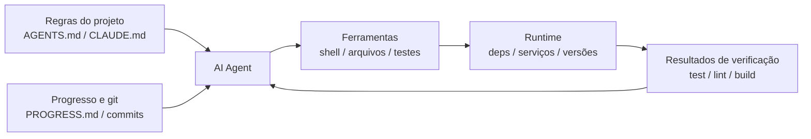

[Versão em Inglês →](../../../en/lectures/lecture-02-what-a-harness-actually-is/)

> Exemplos de código: [code/](https://github.com/walkinglabs/learn-harness-engineering/blob/main/docs/en/lectures/lecture-02-what-a-harness-actually-is/code/)
> Projeto prático: [Projeto 01. Prompt-only vs. rules-first](./../../projects/project-01-baseline-vs-minimal-harness/index.md)

# Lecture 02. O que Harness Realmente Significa

A palavra "harness" é muito usada nos círculos de agentes de codificação de IA, mas honestamente, a maioria das pessoas quer dizer "um arquivo de prompt" quando dizem harness. Isso não é um harness. É como abrir um restaurante com nada além de ingredientes — sem fogão, sem facas, sem receitas, sem workflow de montagem de pratos. Isso não é um restaurante. É uma geladeira.

Esta lecture te dá uma definição precisa e acionável de harness. Não uma abstração acadêmica, mas um framework que você pode usar hoje: um harness consiste em cinco subsistemas, cada um com responsabilidades claras e critérios de avaliação.

## Comece com uma Analogia

Imagine que você é um engenheiro recém-contratado jogado em um projeto com zero documentação. Nenhum README, nenhum comentário no código, ninguém te diz como executar testes, config de CI está enterrada em algum lugar. Você consegue escrever bom código? Talvez — se você for inteligente e paciente o suficiente. Mas você gastará tempo enorme em "descobrir sobre o que é este projeto" em vez de "resolver o problema."

Um agente de IA enfrenta exatamente a mesma situação. E é pior — você pode pelo menos perguntar a um colega. O agent só consegue ver arquivos que você coloca na frente dele e comandos que pode executar. Não pode dar uma cotovelada em alguém e perguntar "ei, qual versão do ORM este projeto usa?"

A OpenAI enquadra o princípio central como "o repo É a spec" — todo contexto necessário deve estar no repositório, entregue através de arquivos de instrução estruturados, comandos de verificação explícitos e organização clara de diretórios. A documentação de agentes de longa duração da Anthropic enfatiza persistência de estado, caminhos de recuperação explícitos e tracking de progresso estruturado. As duas empresas focam em aspectos diferentes, mas estão dizendo a mesma coisa: **tudo na infraestrutura de engenharia fora do modelo determina quanto da capacidade do modelo realmente se realiza.**

Olhe algumas ferramentas que você já conhece:

**Claude Code** incorpora pensamento de harness. Lê `CLAUDE.md` do seu repo (prateleira de receitas), pode executar comandos shell (rack de facas), executa no seu ambiente local (fogão), mantém histórico de sessão (estação de preparo), e pode executar testes e ver resultados (janela de verificação de qualidade). Mas se você não disser como executar testes, a janela de verificação de qualidade está quebrada — ninguém sabe se o prato está totalmente cozido.

**Cursor** segue lógica similar. Seu arquivo `.cursorrules` é a prateleira de receitas, o terminal é o rack de facas, lê sua estrutura de projeto e config de lint para o fogão. Mas o gerenciamento de estado do Cursor é relativamente fraco — feche a IDE e reabra, e o contexto anterior se foi.

**Codex** (agente de codificação da OpenAI) usa git worktrees para isolar o ambiente de runtime de cada tarefa, pareado com um stack de observabilidade local (logs, métricas, traces), então toda mudança é verificada em um ambiente independente. Em repos com `AGENTS.md` e comandos de verificação claros, performa muito melhor que em repos "bare".

**AutoGPT** é o conto de advertência — falta de gerenciamento de estado estruturado leva a acumulação de contexto em tarefas longas, e falta de mecanismos de feedback precisos faz o agent entrar em loop. Muitas pessoas dizem que AutoGPT "não funciona," mas na verdade é o harness do AutoGPT que não funciona — dê a um chef um fogão quebrado e mesmo os melhores ingredientes não produzirão uma refeição.

## Conceitos Centrais

- **O que é um harness**: Tudo na infraestrutura de engenharia fora dos pesos do modelo. A OpenAI destila o trabalho central do engenheiro em três coisas: projetar ambientes, expressar intenção e construir loops de feedback. A Anthropic chama seu Claude Agent SDK de "harness de agent de propósito geral."
- **O repo é a única fonte de verdade**: Qualquer coisa que o agent não consegue ver, para todos os propósitos práticos, não existe. A OpenAI trata o repo como o "system of record" — todo contexto necessário deve viver lá, através de arquivos estruturados e organização clara de diretórios.
- **Dê um mapa, não um manual**: Experiência da OpenAI — `AGENTS.md` deve ser uma página de diretório, não uma enciclopédia. Cerca de 100 linhas é suficiente. Se não couber, divida no diretório `docs/` e deixe o agent ler sob demanda.
- **Restrinja, não microgerencie**: Um bom harness usa regras executáveis para restringir o agent, em vez de enumerar instruções uma por uma. A OpenAI diz "enforce invariants, não microgerencie implementação"; a Anthropic descobriu que agents elogiam confiantemente seu próprio trabalho, e a solução é separar "a pessoa que faz o trabalho" de "a pessoa que verifica o trabalho."
- **Remova componentes um por vez**: Para quantificar o valor de cada componente do harness, remova-os um por vez e veja qual remoção causa a maior queda de performance. A Anthropic usou este método e descobriu que conforme modelos ficam mais fortes, alguns componentes param de ser críticos — mas novos sempre emergem.

## O Modelo de Harness de Cinco Subsistemas

De volta à analogia da cozinha. Uma cozinha completa tem cinco áreas funcionais, e um harness tem cinco subsistemas:



**Subsistema de instrução (prateleira de receitas)**: Crie `AGENTS.md` (ou `CLAUDE.md`) contendo visão geral e propósito do projeto (uma frase), tech stack e versões (Python 3.11, FastAPI 0.100+, PostgreSQL 15), comandos de primeira execução (`make setup`, `make test`), restrições rígidas não-negociáveis ("Todas as APIs devem usar OAuth 2.0"), e links para documentação mais detalhada.

**Subsistema de ferramentas (rack de facas)**: Garanta que o agent tenha acesso suficiente a ferramentas. Não desabilite shell por "segurança" — se o agent não consegue nem executar `pip install`, como deveria trabalhar? Mas não abra tudo também — siga princípios de menor privilégio.

**Subsistema de ambiente (fogão)**: Torne o estado do ambiente auto-descritivo. Use `pyproject.toml` ou `package.json` para travar dependências, `.nvmrc` ou `.python-version` para versões de runtime, Docker ou devcontainers para reprodutibilidade.

**Subsistema de estado (estação de preparo)**: Tarefas longas precisam de tracking de progresso. Use um arquivo simples `PROGRESS.md` registrando: o que está feito, o que está em progresso, o que está bloqueado. Atualize antes de cada sessão terminar, leia quando a próxima sessão começar.

**Subsistema de feedback (janela de verificação de qualidade)**: Este é o subsistema de maior ROI. Liste explicitamente comandos de verificação em `AGENTS.md`:
```
Comandos de verificação:
- Testes: pytest tests/ -x
- Verificação de tipo: mypy src/ --strict
- Lint: ruff check src/
- Verificação completa: make check (inclui todos acima)
```

Perder qualquer subsistema é como perder uma área funcional na cozinha — você ainda pode cozinhar, mas sempre fica estranho.

**Diagnosticando qualidade do harness**: Use "controle de modelo isométrico." Mantenha o modelo fixo, remova subsistemas um por vez, meça qual remoção causa a maior queda de performance. Esse é seu gargalo — foque seu esforço lá. Como encontrar o gargalo em uma cozinha: tire a prateleira de receitas e veja quanto mais lento fica, desligue o fogão e veja o impacto.

## História Real de uma Equipe

Uma equipe usou GPT-4o em uma aplicação frontend TypeScript + React (~20.000 linhas de código). Passaram por quatro estágios — essencialmente adicionando equipamento de cozinha uma peça por vez:

**Estágio 1 — Cozinha vazia**: Apenas uma descrição básica do projeto no README. 1 de 5 execuções teve sucesso (20%). Principais falhas: escolheu package manager errado (npm vs yarn), não seguiu convenções de nomenclatura de componentes, não conseguiu executar testes.

**Estágio 2 — Prateleira de receitas instalada**: Adicionou `AGENTS.md` com versões do tech stack, convenções de nomenclatura, decisões arquiteturais-chave. Taxa de sucesso subiu para 60%. Falhas restantes eram principalmente problemas de ambiente e verificação faltando.

**Estágio 3 — Janela de verificação de qualidade aberta**: Listou comandos de verificação em `AGENTS.md`: `yarn test && yarn lint && yarn build`. Taxa de sucesso subiu para 80%.

**Estágio 4 — Estação de preparo pronta**: Introduziu templates de arquivo de progresso onde agents registravam trabalho completo e incompleto a cada execução. Taxa de sucesso se estabilizou em 80-100%.

Quatro iterações, o modelo não mudou nada, taxa de sucesso foi de 20% para quase 100%. Esse é o poder da harness engineering. Você não comprou ingredientes mais caros — apenas organizou a cozinha adequadamente.

## Principais Takeaways

- Harness = Instruções + Ferramentas + Ambiente + Estado + Feedback. Cinco subsistemas, como as cinco áreas funcionais de uma cozinha — todos essenciais.
- Se não são pesos do modelo, é harness. Seu harness determina quanto da capacidade do modelo se realiza.
- Entre os cinco subsistemas, o subsistema de feedback geralmente tem o menor investimento e maior retorno. Acerte seus comandos de verificação primeiro — a janela de verificação de qualidade é o upgrade mais valioso.
- Use "controle de modelo isométrico" para quantificar a contribuição marginal de cada subsistema — não vá pela intuição.
- Harness apodrece como código. Audite regularmente, pague dívida de harness como você paga dívida técnica.

## Leitura Adicional

- [OpenAI: Harness Engineering](https://openai.com/index/harness-engineering/)
- [Anthropic: Effective Harnesses for Long-Running Agents](https://www.anthropic.com/engineering/effective-harnesses-for-long-running-agents)
- [HumanLayer: Harness Engineering for Coding Agents](https://humanlayer.dev/articles/harness-engineering-for-coding-agents/)
- [SWE-agent: Agent-Computer Interfaces](https://github.com/princeton-nlp/SWE-agent)
- [Thoughtworks: Harness Engineering on Technology Radar](https://www.thoughtworks.com/radar)

## Exercícios

1. **Auditoria de harness de cinco tuplas**: Pegue um projeto onde você usa um agente de IA e faça uma auditoria completa usando o framework de cinco tuplas. Pontue cada subsistema 1-5. Encontre o subsistema com menor pontuação, gaste 30 minutos melhorando-o, então observe a mudança na performance do agent.

2. **Experimento de controle de modelo isométrico**: Escolha um modelo e uma tarefa desafiadora. Sequencialmente remova instruções (delete AGENTS.md), remova feedback (não forneça comandos de verificação), remova estado (nenhum arquivo de progresso) — remova apenas um por vez e meça a queda de performance. Baseado nos resultados, ranqueie importância de subsistema para seu projeto.

3. **Análise de affordance**: Encontre um cenário onde o agent no seu projeto "quer fazer algo mas não consegue" (ex: sabe que deveria usar queries parametrizadas mas não conhece os padrões de ORM do seu projeto). Analise se isso é um Gulf of Execution (não sabe como) ou Gulf of Evaluation (não sabe se está certo), então projete uma melhoria de harness para fazer a ponte.