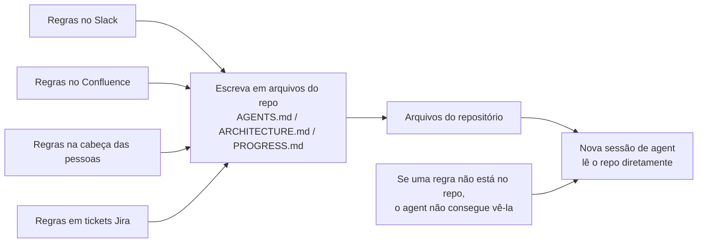
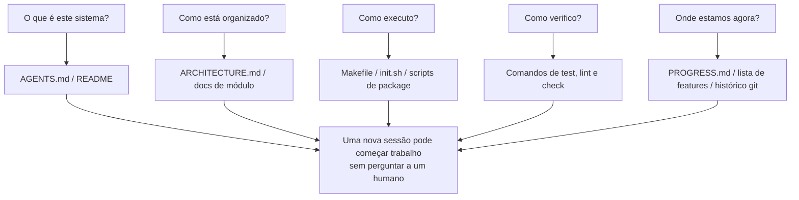

[Versão em Inglês →](../../../en/lectures/lecture-03-why-the-repository-must-become-the-system-of-record/)

> Exemplos de código: [code/](https://github.com/walkinglabs/learn-harness-engineering/blob/main/docs/en/lectures/lecture-03-why-the-repository-must-become-the-system-of-record/code/)
> Projeto prático: [Projeto 02. Agent-readable workspace](./../../projects/project-02-agent-readable-workspace/index.md)

# Lecture 03. Torne o Repositório Sua Única Fonte de Verdade

As decisões arquiteturais da sua equipe estão espalhadas pelo Confluence, Slack, Jira e nas cabeças de alguns engenheiros seniores. Para humanos isso mal funciona — você pode perguntar a um colega, pesquisar histórico de chat, vasculhar docs. Se tudo mais falhar, você pode encurralar alguém na copa. Mas para um agente de IA, informação que não está no repositório simplesmente não existe.

Isso não é exagero. Pense sobre quais são realmente os inputs de um agent: prompts de sistema e descrições de tarefa, conteúdos de arquivo do repositório, e output de execução de ferramentas. É isso. Seu histórico do Slack, tickets do Jira, páginas do Confluence, e aquela decisão arquitetural que você discutiu com um colega tomando café na sexta à tarde — o agent não consegue ver nada disso. Não pode "ir perguntar para alguém" ou "pesquisar o histórico do chat." É um engenheiro trancado dentro do repositório — tudo do lado de fora, não sabe nada sobre.

Então a pergunta se torna: você vai dar a esse engenheiro um bom mapa?

## O que Pertence ao Mapa

A OpenAI afirma isso diretamente: **informação que não existe no repo, não existe para o agent.** Eles chamam isso de princípio "repo as spec" — o próprio repositório é o documento de especificação de maior autoridade.

A documentação de agentes de longa duração da Anthropic ecoa isso: estado persistente é uma condição necessária para continuidade de tarefas longas. Recuperabilidade de conhecimento cross-session determina diretamente taxas de sucesso de tarefas. E esse estado deve existir no repositório — porque é o único armazenamento estável e acessível que o agent tem.

Você pode pensar: "Nossa equipe é pequena, conhecimento está na cabeça de todos, e funciona bem." Claro, para humanos. Mas se você está usando um agent, aceite este fato: o agent não pode perguntar para pessoas. Tudo que precisa saber deve estar escrito e colocado onde pode encontrar.

Isso não é sobre "escrever mais documentação." É sobre "colocar informação de decisão no lugar certo." Um `ARCHITECTURE.md` de 50 linhas no diretório `src/api/` é dez mil vezes mais útil que um documento de design de 500 páginas no Confluence que ninguém mantém. É como um mapa de escritório desenhado à mão colado na sua mesa versus uma planta arquitetural linda trancada em um arquivo — o primeiro está ali quando você precisa; o segundo é tecnicamente superior mas inútil no momento.

## Visibilidade de Conhecimento



Como você testa se seu mapa é bom o suficiente? Execute um "teste de cold-start": abra uma sessão de agent completamente nova usando apenas conteúdos do repo, e veja se consegue responder cinco perguntas básicas:



Se não consegue responder, o mapa tem pontos em branco. Onde o mapa está em branco, o agent adivinha — palpites errados se tornam bugs, adivinhação excessiva desperdiça contexto. E toda nova sessão adivinha tudo de novo. O custo de adivinhar é sempre maior que o custo de desenhar o mapa adequadamente em primeiro lugar.

## Conceitos Centrais

- **Knowledge Visibility Gap**: A proporção do conhecimento total do projeto que NÃO está no repositório. Quanto maior o gap, maior a taxa de falha do agent. Quanto conhecimento implícito sobre este projeto vive na sua cabeça? Conte tudo, então veja quanto chegou ao repo — a diferença é seu visibility gap.
- **System of Record**: O repositório de código como fonte autoritativa para decisões de projeto, restrições arquiteturais, estado de execução e padrões de verificação. O repo tem a palavra final, nenhum outro lugar conta. Como um mapa que marca "estrada fechada" — você não vai por essa estrada. Mas se essa informação só existe na cabeça do Seu João, você tem que perguntar ao Seu João toda vez.
- **Cold-Start Test**: As cinco perguntas acima. Quantas consegue responder é quão completo seu mapa está.
- **Discovery Cost**: Quanto budget de contexto o agent queima para encontrar uma informação-chave no repo. Quanto mais escondida a informação, maior o discovery cost, e menos budget sobra para a tarefa real. Esconder informação crítica em um README dez níveis de diretório abaixo é como trancar o extintor de incêndio em um cofre no porão — existe, mas você não consegue encontrar quando precisa.
- **Knowledge Decay Rate**: A proporção de entradas de conhecimento que ficam obsoletas por unidade de tempo. Documentação saindo de sincronia com código é o maior inimigo — pior que nenhuma documentação.
- **Analogia ACID**: Aplicar princípios de transação de banco de dados (Atomicity, Consistency, Isolation, Durability) ao gerenciamento de estado do agent. Expandiremos isso abaixo.

## Como Desenhar um Bom Mapa

**Princípio 1: Conhecimento vive próximo ao código.** Uma regra sobre autenticação de endpoint de API pertence próximo ao código da API, não enterrada em um documento global gigante. Coloque um doc curto em cada diretório de módulo explicando responsabilidades, interfaces e restrições especiais desse módulo. Como etiquetas de prateleira de biblioteca — você quer livros de história, vai direto para a prateleira marcada "História." Não precisa pesquisar a biblioteca inteira.

**Princípio 2: Use um arquivo de entrada padronizado.** `AGENTS.md` (ou `CLAUDE.md`) é a "landing page" do agent. Não precisa conter toda informação, mas deve deixar o agent rapidamente responder três perguntas: "O que é este projeto," "Como executo," e "Como verifico." 50-100 linhas é suficiente.

**Princípio 3: Mínimo mas completo.** Toda informação deve ter um caso de uso claro. Se remover uma regra não afeta a qualidade de decisão do agent, essa regra não deveria existir. Mas toda pergunta do cold-start test deve ter uma resposta. Este é um equilíbrio delicado — não muito, não pouco, apenas o suficiente.

**Princípio 4: Atualize com código.** Vincule atualizações de conhecimento a mudanças de código. A abordagem mais simples: coloque docs de arquitetura no diretório do módulo correspondente. Quando você modifica código, naturalmente vê o doc. Após mudanças de código, CI pode lembrar você de verificar se docs precisam de atualização.

**Estrutura concreta de repo**:

```
project/
├── AGENTS.md              # Entrada: visão geral do projeto, comandos de execução, restrições rígidas
├── src/
│   ├── api/
│   │   ├── ARCHITECTURE.md  # Decisões arquiteturais da camada API
│   │   └── ...
│   ├── db/
│   │   ├── CONSTRAINTS.md   # Restrições rígidas de operação de banco de dados
│   │   └── ...
│   └── ...
├── PROGRESS.md             # Progresso atual: feito, em-progresso, bloqueado
└── Makefile                # Comandos padronizados: setup, test, lint, check
```

## Gerenciando Estado do Agent com Princípios ACID

Esta analogia vem do gerenciamento de transação de banco de dados — você pode pensar que está complicando demais, mas na verdade te dá um framework muito prático:

- **Atomicity**: Cada "operação lógica" (ex: "adicionar novo endpoint e atualizar testes") recebe um commit git. Se falhar no meio, `git stash` para fazer rollback. Tudo ou nada — nenhum "meio feito."
- **Consistency**: Defina predicados de verificação de "estado consistente" — todos os testes passam, lint reporta zero erros. O agent executa verificação após cada operação; estados intermediários inconsistentes não são commitados. Como uma transferência bancária — você não pode debitar sem creditar.
- **Isolation**: Quando múltiplos agents trabalham concorrentemente, projete arquivos de estado para evitar race conditions. Abordagem simples: cada agent usa seu próprio arquivo de progresso, ou use branches git para isolamento. Dois chefs não podem temperar a mesma panela simultaneamente — quem assume responsabilidade quando fica salgada demais?
- **Durability**: Conhecimento crítico do projeto vive em arquivos rastreados pelo git. Estado temporário pode ficar na memória da sessão, mas conhecimento cross-session deve ser persistido em arquivos. O que está na sua cabeça não conta — só o que está no papel conta.

## Uma História Real de Transformação

Uma equipe mantinha uma plataforma de e-commerce com ~30 microserviços. Decisões arquiteturais (protocolos de comunicação inter-serviço, estratégias de consistência de dados, regras de versionamento de API) estavam espalhadas por: Confluence (parcialmente desatualizado), Slack (difícil de pesquisar), cabeças de alguns engenheiros seniores (não escalável), e comentários esporádicos de código (não sistemático).

Após introduzir agentes de IA, 70% das tarefas requeriam intervenção humana. Quase toda falha envolvia o agent violando alguma restrição implícita "todo mundo sabe mas ninguém escreveu." É como um funcionário novo a quem ninguém disse "você precisa postar seu pedido de almoço no chat do grupo" — eles adivinham errado, são repreendidos, mas após a repreensão ainda ninguém conta a regra.

A equipe executou uma transformação:
1. Criou `AGENTS.md` na raiz do repo com visão geral do projeto, versões do tech stack e restrições rígidas globais
2. Adicionou `ARCHITECTURE.md` em cada diretório de microserviço descrevendo responsabilidades, interfaces e dependências
3. Criou um `CONSTRAINTS.md` centralizado com restrições rígidas em linguagem explícita "DEVE/NÃO DEVE"
4. Adicionou `PROGRESS.md` em cada diretório de serviço rastreando status de trabalho atual

Após transformação: o mesmo agent conseguia responder todas as perguntas-chave do projeto em cold start, e a qualidade de conclusão de tarefas melhorou significativamente.

## Principais Takeaways

- Conhecimento não no repo não existe para o agent. Colocar decisões críticas no repo é o investimento de harness mais básico — desenhe um bom mapa para não se perder.
- Use o "cold-start test" para avaliar qualidade do repo: uma sessão nova consegue responder cinco perguntas básicas usando apenas conteúdos do repo?
- Conhecimento deve estar próximo ao código, mínimo mas completo, e atualizado com código. Não é sobre escrever mais docs — é sobre colocar informação no lugar certo.
- Use princípios ACID para estado do agent: commits atômicos, verificação de consistência, isolamento de concorrência, conhecimento crítico durável.
- Knowledge decay é o maior inimigo. Documentação fora de sincronia com código é mais perigosa que nenhuma documentação — manda o agent na direção errada enquanto pensam que estão certos.

## Leitura Adicional

- [OpenAI: Harness Engineering](https://openai.com/index/harness-engineering/)
- [Anthropic: Effective Harnesses for Long-Running Agents](https://www.anthropic.com/engineering/effective-harnesses-for-long-running-agents)
- [Infrastructure as Code — Martin Fowler](https://martinfowler.com/bliki/InfrastructureAsCode.html)
- [ADR: Architecture Decision Records](https://adr.github.io/)
- [The Twelve-Factor App](https://12factor.net/)

## Exercícios

1. **Cold-start test**: Abra uma sessão de agent completamente nova no seu projeto (nenhum contexto verbal, apenas conteúdos do repo). Faça cinco perguntas: O que é este sistema? Como está organizado? Como executo? Como verifico? Qual é o progresso atual? Registre o que não consegue responder, então melhore o repo até conseguir.

2. **Quantificação de externalização de conhecimento**: Liste todas as decisões e restrições importantes para trabalho de desenvolvimento no seu projeto. Marque cada uma como dentro ou fora do repo. Calcule seu knowledge visibility gap (proporção fora do repo). Faça um plano para deixar abaixo de 10%.

3. **Avaliação ACID**: Avalie o gerenciamento de estado do seu projeto usando a analogia ACID desta lecture. Atomicity — operações do agent podem ser cleanly rolled back? Consistency — há verificação de "estado consistente"? Isolation — agents concorrentes pisam uns nos outros? Durability — todo conhecimento cross-session está persistido?