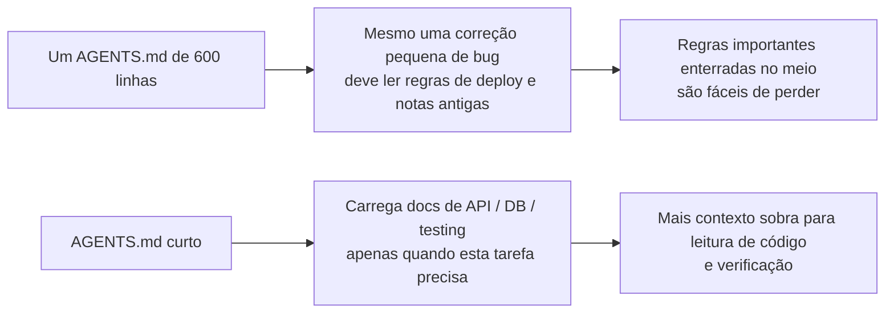
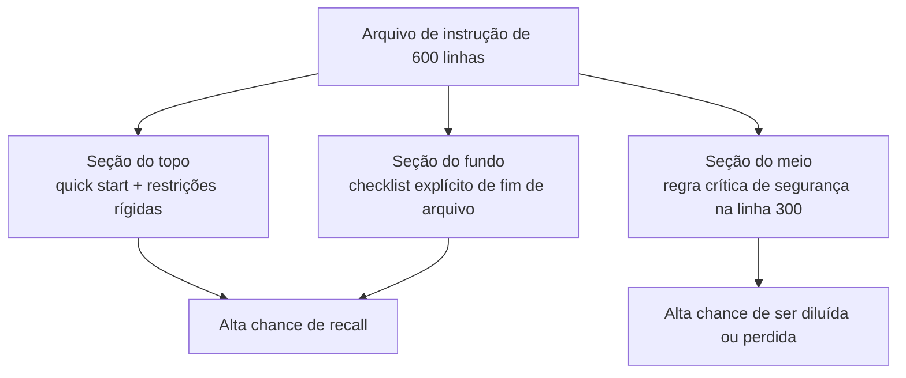

[Versão em Inglês →](../../../en/lectures/lecture-04-why-one-giant-instruction-file-fails/)

> Exemplos de código: [code/](https://github.com/walkinglabs/learn-harness-engineering/blob/main/docs/en/lectures/lecture-04-why-one-giant-instruction-file-fails/code/)
> Projeto prático: [Projeto 02. Agent-readable workspace](./../../projects/project-02-agent-readable-workspace/index.md)

# Lecture 04. Divida Instruções Entre Arquivos

Você ficou sério sobre harness engineering — bom para você. Criou um `AGENTS.md` e empacotou toda regra, restrição e lição aprendida que conseguiu pensar nele. Um mês depois o arquivo inchou para 300 linhas, dois meses 450 linhas, três meses 600 linhas. Então você nota que a performance do agent está na verdade piorando — em uma correção simples de bug, o agent queima toneladas de contexto processando instruções irrelevantes de deployment; uma restrição crítica de segurança enterrada na linha 300 é completamente ignorada; três regras contraditórias de estilo de código significam que o agent escolhe uma aleatoriamente a cada vez.

Esta é a armadilha do "arquivo de instrução gigante." É como fazer as malas demais — tudo parece útil, então você empurra tudo até o zíper estar prestes a estourar. Encontrar sua muda de roupa íntima significa esvaziar a mala inteira. Você carregou uma mala cheia, mas na verdade usou talvez um terço do que está dentro.

## O Ciclo Vicioso na Raiz

O ciclo vicioso mais comum vai assim: agent comete um erro, você diz "adicione uma regra para prevenir isso," adiciona ao AGENTS.md, funciona temporariamente, agent comete um erro diferente, adiciona outra regra, repete, arquivo incha fora de controle.

Isso não é sua culpa. É uma reação muito natural — "adicionar uma regra" cada vez que algo dá errado parece razoável, como jogar mais uma coisa na sua mala toda vez que sai de casa "só por precaução." Mas o efeito cumulativo é desastroso. Vamos ver o que dá errado especificamente.

**Budget de contexto é devorado vivo.** A janela de contexto do agent é finita. Digamos que seu agent tem uma janela de 200K tokens (padrão do Claude). Um arquivo de instrução inchado pode comer 10-20K tokens. Parece que ainda há bastante espaço? Mas uma tarefa complexa pode precisar ler dezenas de arquivos fonte, output de execução de ferramenta também toma contexto, e histórico de conversa se acumula. Quando o agent precisa entender o código, o budget já está apertado — como uma mala tão cheia de itens "só por precaução" que não há espaço para seu laptop.

**Perdido no meio.** O paper "Lost in the Middle" (Liu et al., 2023) demonstrou claramente que LLMs utilizam informação no meio de textos longos significativamente menos efetivamente que no início ou fim. Seu AGENTS.md tem 600 linhas, e a linha 300 diz "todas as queries de banco de dados devem usar queries parametrizadas" — essa é uma restrição rígida de segurança. Mas está enterrada no meio, e o agent quase certamente vai ignorá-la. Como aquele protetor solar no fundo da sua mala lotada — você sabe que está lá, escava três vezes, não consegue encontrar, acaba comprando outro.

**Conflitos de prioridade.** O arquivo mistura restrições rígidas não-negociáveis ("nunca use eval()"), diretrizes importantes de design ("prefira estilo funcional"), e uma lição histórica específica ("corrigiu um memory leak de WebSocket semana passada, fique atento a padrões similares"). Essas três regras têm níveis de importância completamente diferentes, mas parecem idênticas no arquivo. O agent não tem sinal confiável para distinguir — como seu passaporte e cabo de carregador misturados na mala, sem jeito de dizer qual é mais urgente.

**Decay de manutenção.** Arquivos grandes são inerentemente difíceis de manter. Instruções desatualizadas raramente são deletadas — porque as consequências da deleção são incertas ("talvez algo mais dependa desta regra?"), enquanto adicionar novas instruções parece gratuito. O resultado: o arquivo só cresce, nunca encolhe, e a razão sinal-ruído continuamente declina. Isso é exatamente como acumulação de dívida técnica em software.

**Acumulação de contradição.** Instruções adicionadas em momentos diferentes começam a se contradizer — uma diz "use TypeScript strict mode," outra diz "alguns arquivos legacy permitem any types." O agent escolhe aleatoriamente uma para seguir a cada vez. Como sua mãe dizendo "se agasalhe" e seu pai dizendo "não use muita roupa," e você parado na porta sem saber quem ouvir.

## Conceitos Centrais

- **Instruction Bloat**: Quando um arquivo de instrução ocupa mais que 10-15% da janela de contexto, começa a expulsar budget para leitura de código e raciocínio de tarefa. Um `AGENTS.md` de 600 linhas pode consumir 10.000-20.000 tokens — isso é 8-15% de uma janela de 128K comida antes do agent nem começar.
- **Lost in the Middle Effect**: A pesquisa de Liu et al. de 2023 provou que LLMs usam informação no meio de textos longos significativamente menos efetivamente que informação no início ou fim. Uma restrição crítica enterrada na linha 300 de um arquivo de 600 linhas tem probabilidade muito alta de ser efetivamente ignorada.
- **Instruction Signal-to-Noise Ratio (SNR)**: A proporção de instruções em um arquivo que são relevantes para a tarefa atual. Ser forçado a ler 50 linhas de instruções de deployment durante uma correção de bug — isso é SNR baixo.
- **Routing File**: Um arquivo de entrada curto cuja função central é apontar o agent para docs mais detalhados, não conter tudo ele mesmo. 50-200 linhas é suficiente.
- **Progressive Disclosure**: Dê informação de visão geral primeiro, informação detalhada quando necessário. Bom design de harness é como bom design de UI — não despeje todas as opções no usuário de uma vez.
- **Priority Ambiguity**: Quando todas as instruções aparecem no mesmo formato e local, o agent não consegue distinguir restrições rígidas não-negociáveis de diretrizes suaves sugestivas.

## Arquitetura de Instrução





## Como Dividir

Princípio central: mantenha informação frequentemente necessária à mão, guarde informação ocasionalmente necessária, e deixe para trás o que nunca usará.

O arquivo de entrada `AGENTS.md` fica em 50-200 linhas, contendo apenas os itens mais frequentemente usados — visão geral do projeto (uma ou duas frases), comandos de primeira execução (`make setup && make test`), restrições rígidas globais (não mais que 15 regras não-negociáveis), e links para documentos de tópico (descrição de uma linha + condição de aplicabilidade).

```markdown
# AGENTS.md

## Visão Geral do Projeto
Backend Python 3.11 FastAPI, banco de dados PostgreSQL 15.

## Quick Start
- Instalar: `make setup`
- Testar: `make test`
- Verificação completa: `make check`

## Restrições Rígidas
- Todas as APIs devem usar autenticação OAuth 2.0
- Todas as queries de banco de dados devem usar sintaxe SQLAlchemy 2.0
- Todos os PRs devem passar pytest + mypy --strict + ruff check

## Docs de Tópico
- [Padrões de Design de API](docs/api-patterns.md) — Leitura obrigatória ao adicionar endpoints
- [Regras de Banco de Dados](docs/database-rules.md) — Obrigatório ao modificar operações de banco de dados
- [Padrões de Testing](docs/testing-standards.md) — Referência ao escrever testes
```

Cada documento de tópico tem 50-150 linhas, organizado por assunto no diretório `docs/` ou próximo ao módulo correspondente. O agent só os lê quando necessário. Como cubos organizadores em uma mala — roupa íntima em um cubo, produtos de higiene em outro, carregadores em um terceiro. Encontrar coisas não requer esvaziar a mala inteira.

Algumas informações são melhor colocadas diretamente no código — definições de tipo, comentários de interface, explicações em arquivos de config. O agent naturalmente as vê ao ler código, não precisa duplicar em instruções.

Toda instrução deve ter uma fonte ("por que esta regra foi adicionada?"), uma condição de aplicabilidade ("quando esta regra é necessária?"), e uma condição de expiração ("sob que circunstâncias esta regra pode ser removida?"). Audite regularmente, remova entradas desatualizadas, redundantes e contraditórias. Gerencie suas instruções como você gerencia dependências de código — dependências não usadas devem ser deletadas, senão apenas deixam o sistema mais lento.

Se uma instrução deve estar no arquivo de entrada, coloque no topo ou fundo — nunca no meio. O efeito "lost in the middle" nos diz que LLMs usam informação nos extremos significativamente melhor que no centro. Mas a melhor abordagem é mover instruções para documentos de tópico para carregamento sob demanda.

Tanto OpenAI quanto Anthropic implicitamente apoiam a abordagem de divisão. OpenAI diz que arquivos de entrada devem ser "curtos e orientados a roteamento," Anthropic diz que informação de controle de agent de longa duração deve ser "concisa e de alta prioridade." Ambos estão dizendo a mesma coisa: não enfie tudo em um arquivo. Uma mala precisa de organização, não apenas empurrar com força bruta.

## Exemplo do Mundo Real

O `AGENTS.md` de uma equipe SaaS inchou de 50 linhas para 600. Conteúdos misturavam versões do tech stack, padrões de codificação, notas históricas de correção de bug, guias de uso de API, procedimentos de deployment, e preferências pessoais de membros da equipe — a mala inteira estourando nas costuras.

A performance do agent começou a declinar visivelmente: durante correções simples de bug o agent gastava muito contexto processando instruções irrelevantes de deployment; a restrição de segurança "todas as queries de banco de dados devem usar queries parametrizadas" estava enterrada na linha 300 e frequentemente ignorada; três regras contraditórias de estilo de código causavam comportamento aleatório do agent.

A equipe executou uma "reorganização de mala":
1. `AGENTS.md` aparado para 80 linhas: apenas visão geral do projeto, comandos de execução, e 15 restrições rígidas globais
2. Criou documentos de tópico: `docs/api-patterns.md` (120 linhas), `docs/database-rules.md` (60 linhas), `docs/testing-standards.md` (80 linhas)
3. Adicionou links de documentos de tópico no arquivo de roteamento
4. Notas históricas ou convertidas em casos de teste ou deletadas

Após refatoração: taxa de sucesso do mesmo conjunto de tarefas foi de 45% para 72%. Compliance de restrição de segurança foi de 60% para 95% — porque moveu do meio do arquivo para o topo do arquivo de roteamento, não mais "perdida no meio."

## Principais Takeaways

- "Adicionar uma regra" é alívio de dor de curto prazo, veneno de longo prazo. Antes de adicionar uma regra, pergunte: isso seria melhor em um documento de tópico? Não apenas continue empurrando coisas na mala.
- O arquivo de entrada é um roteador, não uma enciclopédia. 50-200 linhas com visão geral, restrições rígidas e links apenas.
- Aproveite o efeito "lost in the middle": info importante vai no topo ou fundo; info sem importância move para documentos de tópico.
- Gerencie instruction bloat como dívida técnica. Auditorias regulares, toda instrução precisa de fonte, condição de aplicabilidade e condição de expiração.
- Após dividir, SNR melhora e o agent gasta mais budget de contexto em tarefas reais em vez de processar instruções irrelevantes.

## Leitura Adicional

- [OpenAI: Harness Engineering](https://openai.com/index/harness-engineering/)
- [Anthropic: Effective Harnesses for Long-Running Agents](https://www.anthropic.com/engineering/effective-harnesses-for-long-running-agents)
- [Lost in the Middle: How Language Models Use Long Contexts](https://arxiv.org/abs/2307.03172)
- [HumanLayer: Harness Engineering for Coding Agents](https://humanlayer.dev/articles/harness-engineering-for-coding-agents/)
- [Nielsen Norman Group: Progressive Disclosure](https://www.nngroup.com/articles/progressive-disclosure/)

## Exercícios

1. **Auditoria SNR**: Pegue seu arquivo de instrução de entrada atual e liste todas as entradas de instrução. Escolha 5 tipos diferentes de tarefa comum e marque se cada instrução é relevante para essa tarefa. Calcule SNR para cada tipo de tarefa. Instruções que são ruído para a maioria das tarefas devem mover para documentos de tópico.

2. **Refatoração de progressive disclosure**: Se você tem um arquivo de instrução com mais de 300 linhas, divida em: (a) um arquivo de roteamento com menos de 100 linhas, (b) 3-5 documentos de tópico. Execute o mesmo conjunto de tarefas (pelo menos 5) antes e depois, compare taxas de sucesso.

3. **Verificação de lost in the middle**: Em um arquivo de instrução longo, coloque uma restrição crítica no topo, meio e fundo respectivamente, executando o mesmo conjunto de tarefas cada vez (pelo menos 5 execuções por posição). Veja se há diferença na taxa de compliance. Você pode se surpreender com quão forte é o efeito de posição.